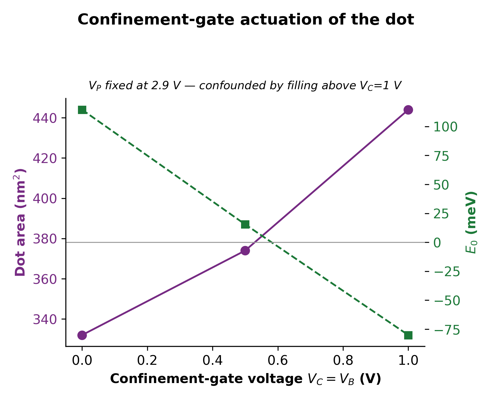

# imec Quantum-Dot QTCAD Simulation

A finite-element Schrödinger-Poisson simulation of imec's published gate-defined
silicon quantum-dot device, built from scratch and calibrated against imec's own
published measurements and simulations.

This is quantum-device TCAD: simulating the electrostatics and quantum confinement
of a spin-qubit platform, as distinct from classical semiconductor device TCAD.
Everything measured so far is reported below — this README is meant to be
self-contained; the `docs/` folder has the same material in more detail for anyone
who wants it, but nothing here requires clicking through.

**Status: Phase 0 (model correctness) complete.** Phase 1 (extending this to novel
device architectures) is in progress; results will be added to this README as
they're produced.

---

## 1. The device

A 3×3 interior cell of imec's published **7×7 SiMOS quantum-dot array**:

- 300 mm SiMOS platform, EUV lithography, enriched Si-28 substrate, **110 nm**
  dot-to-dot pitch.
- **Overlapping-gate architecture**, three polysilicon gate layers separated by
  SiO₂:

  | layer | gates | role |
  |---|---|---|
  | GL1 | C1…C8 | confinement gates — form the columns |
  | GL2 | P1…P7, D, S1…S7 | plungers (row control) + accumulation gates |
  | GL3 | B1…B8 | barrier gates — separate the rows |

- Each gate layer sits on a different oxide thickness (t1 thermally grown; t2, t3
  CVD at 780 °C), stepped across 8 fabricated samples: t1 ∈ {8, 12, 15, 20} nm,
  with δ2 = t2−t1 ≈ 4.6 nm and δ3 = t3−t2 ≈ 0.8 nm fixed across all of them
  (392 dots total, 98 per oxide condition).
- Measured at 200 mK (Kiutra ADR fridge); electron temperature 1.4 ± 0.06 K from
  Coulomb-peak lineshape fitting.

**Published single-dot targets** (sample E, t1 = 15 nm, t2 = 19.5 nm):

```
charging energy       E_C  ~ 4 meV        (quoted as "~", order-of-magnitude)
level splitting        ΔE  ~ 0.7 meV       (paper says "level splitting" — could be
                                            orbital or valley, left ambiguous)
plunger capacitance    C_P = 6.61 aF       (parallel-plate FIT to measured Coulomb
                                            diamonds — A=3733 nm², δ2=4.5 nm are
                                            the paper's own fitted values, 3% spread)
total dot capacitance  C_Σ = e/E_C ~ 40 aF  (26% spread — dominated by source/drain
                                            coupling, not the plunger)
lever arm              α = C_P/C_Σ ~ 0.165
dot size               3733 nm² fitted, ~50 × 70 nm elongated
```

Not published (assumed and declared in the model): polysilicon gate doping/work
function, substrate doping, interface trap density, individual gate widths beyond
the dot footprint and pitch.


*Simulated conduction-band edge through the gate stack: the four confinement
gates (C1–C4) as the high-band-edge peaks above the interface, flat substrate
band below.*


*In-plane confinement at the biased plunger row — three candidate dot sites
(gaps between confinement gates), the central one used for all Schrödinger
solves below.*

---

## 2. Method and pipeline

Built with [QTCAD](https://docs.nanoacademic.com/qtcad/) 2.2.5 (Nanoacademic
Technologies), a finite-element Schrödinger-Poisson solver.
**Can:** non-linear self-consistent Poisson (Fermi-Dirac, incomplete ionization),
effective-mass Schrödinger, many-body/chemical-potential addition energies,
multivalley EMT (a real valley-splitting calculation from Bloch amplitudes).
**Cannot:** drift-diffusion transport, mobility models, self-heating — and there
is no "threshold voltage" concept, so any V_th comparison needs a declared proxy.

Pipeline: geometry builder (real gate widths, coarse mesh globally with local
refinement around the dot) → device + non-linear Poisson solve → confined
Schrödinger solve on a sub-mesh around the central dot → bias sweeps for lever
arm, orbital spectrum, and many-body addition energies → post-hoc field/footprint
extraction from the saved potential.

One documented API subtlety worth flagging for anyone using the same tool: QTCAD
defines **two genuinely different lever arms** — `leverarm.Solver` fits
single-particle energies vs. gate bias, while the Coulomb-peak route fits chemical
potentials vs. gate bias. Both are reported below, under different names
(`α_sp`, `α_μ`), and never compared across each other's literature values.

---

## 3. Results

### 3.1 Method validation (independent of imec)

Checked against tool-vendor references and independent literature before trusting
the model on imec's own device.

| check | result |
|---|---|
| Reproduction of a vendor-documented reference device (full Schrödinger-Poisson chain) | **<0.1% error** on every reported quantity — addition energies (0.08%, 0.08%), capacitances (0.04%, 0.04%) |
| Valley-splitting solver vs. published benchmark (Gamble et al., *Appl. Phys. Lett.* 109, 253101, 2016) | **exact linear reproduction**, 0.1025 meV per MV/m (0.513 meV @ 5 MV/m, 5.12 meV @ 50 MV/m) |
| Single-particle lever arm α_sp vs. a comparable industrial FD-SOI device (Beaudoin et al.) | **0.283 eV/V** vs. 0.26 eV/V published, **+8.9%** |
| α_sp vs. chemical-potential lever arm α_μ, internal cross-check | **agree to 2%** (0.283 vs. 0.278 eV/V) — differed by 25× before the bug fix in §4 |

### 3.2 Calibrated against imec's own simulation (Mohiyaddin et al., IEDM 2019)

Simulation-to-simulation comparison, same device family, same solver class
(Sentaurus `sband` and QTCAD are both FEM Schrödinger-Poisson solvers) — the
methodologically matched comparator for a first-principles 3D calculation.

| quantity | this simulation | imec (simulated) | agreement |
|---|---|---|---|
| Gate-to-dot capacitance (t_ox = 20 nm) | 1.45 aF | 0.55 – 2.2 aF | inside range |
| Voltage for first electron (t_ox = 20 nm) | 3.29 V | 1.45 – 4.05 V | inside range |
| Orbital level spacing, few-electron regime | 10.7 – 11.3 meV | ~10 meV | consistent |
| Vertical confining field in the dot | 309 – 329 kV/cm | ~200 kV/cm | same order (~1.6×) |
| Gate work function (published value, adopted not fitted) | 4.70 eV | 4.70 eV | exact |

### 3.3 Compared against imec's measured device (Loenders et al.)

Direct comparison to the fabricated, measured array, reported with the reason
behind each ratio — the numbers that don't match a naive read are exactly the
ones that need explaining, not omitting.

| quantity | this simulation | imec (measured, fitted) | ratio | why |
|---|---|---|---|---|
| Plunger capacitance C_P | 1.45 aF | 6.1 ± 0.2 aF | 4.2× low | imec's value is a **parallel-plate fit** to Coulomb-diamond data, not a first-principles capacitance. Their own 3D simulation (§3.2) lands in the same range this does. |
| Total dot capacitance C_Σ | 5.22 aF | 40 ± 10 aF | 7.7× low | This model has no source/drain reservoirs — on the real array, C_Σ is dominated by reservoir coupling, not the plunger, per imec's own paper. Declared scope limit, not a fitting error. |
| Charging energy E_C | 30.7 meV | 4.0 meV | 7.7× high | Same reservoir-coupling effect as C_Σ (E_C = e/C_Σ); consistent in direction and magnitude with the isolated-dot assumption. |
| Lever arm α = C_P/C_Σ | 0.278 | 0.152 | 1.8× high | The one quantity here with **no simulation comparator to check against** — Mohiyaddin don't publish a simulated α. Genuinely open, not yet explained. |

### 3.4 Confinement-gate actuation (operating-point sweep, not a geometry fit)

At fixed plunger bias (V_P = 2.9 V), raising the confinement/barrier gate voltage
grows the dot and lowers the orbital spacing — confirming the expected mechanism,
though weakly and confounded by electron filling above V_C = 1.0 V (plunger was
not re-tuned to hold electron number constant at each point):

| V_C = V_B (V) | dot area (nm²) | orbital spacing (meV) |
|---|---|---|
| 0.00 | 332 | 10.86 |
| 0.50 | 374 | 9.24 |
| 1.00 | 444 | 7.21 |



---

## 4. A bug, found and fixed

Partway through the project, the single-particle lever arm came out **0.0089
eV/V** — roughly **30× smaller** than the 0.26 eV/V expected for a comparable
device (§3.1). The Poisson solve converged cleanly both times; nothing in the log
flagged a problem.

**Root cause**, found by re-reading QTCAD's own worked examples line by line
(not by running more simulations): every vendor example that places a quantum dot
under the non-linear Poisson solver calls `d.set_dot_region(region)` before
solving. This project's device script didn't call it anywhere.

`set_dot_region()` tells the solver to zero the classical (Thomas-Fermi) charge
density inside the dot region, so those electrons are treated quantum-mechanically
instead of as a classical gas. Without it, a classical accumulation layer forms
exactly where the dot should be and electrostatically screens the plunger gate —
which is why the conduction-band minimum stayed pinned across a wide bias range.

**The fix** is one line, added before the device is returned from its
constructor: `d.set_dot_region(QD_REGIONS)`.

**Verification, done in order, not skipped to a full re-run:**
1. Re-solved Poisson at one bias point — the conduction-band minimum stopped
   being pinned (−0.0699 eV → −0.0215 eV at the same bias).
2. Re-solved Schrödinger at two nearby bias points — the ground-state energy
   moved **25× more per volt** than before: α_sp went from 0.0112 to **0.2831
   eV/V**, landing within **8.9%** of the reference value.
3. Cross-checked against the independently-computed chemical-potential lever arm
   α_μ. Pre-fix, the two lever arms differed by 25× — itself a red flag even
   before the root cause was known. Post-fix, they agree to **2%**.

**Scope check, to avoid overcorrecting:** rather than assume the bug invalidated
every prior result, the many-body (chemical-potential) energies were directly
compared pre-fix vs. post-fix at several bias points — they matched to 5
significant figures. Reason: a separate solver flag
(`bound_state_charges_only = True`) already excluded the classical continuum from
that specific calculation, so the missing call was redundant there, even though it
was essential for the single-particle path. Declaring a bug's *exact* scope,
rather than its plausible worst case, avoided discarding valid results.

**Two smaller pitfalls, found the same way:**
- An early version computed "orbital spacing" as `E[1] - E[0]`. But the model also
  calls `set_valley_splitting(v)`, which replaces every level `E` by `E ± v/2` —
  so `E[1] - E[0]` is *identically* the valley splitting supplied as input, at any
  bias, in any geometry. A suspiciously constant number was the tell; the real
  orbital spacing is `E[2] - E[0]`.
- An addition energy was mislabeled as a charging energy without accounting for
  valley structure: with valley splitting explicit, `E_add(2) = E_C + Δ_valley`
  (the third electron enters the upper valley partner), so quoting `E_add(2)`
  directly as `E_C` overstates it by exactly the injected splitting.


---

## 5. Future work

Extending this validated model to novel device architectures beyond the imec
reference array. Not yet started; results will be added to this README once
produced.

---

## 6. Repository layout

```
src/          simulation scripts (geometry builder, device/solver, campaigns,
              post-hoc field/footprint extraction, figure generation)
results/      extracted numeric results (text), the raw material for the tables above
figures/      the 9 figures referenced above and in the docs
docs/         the same material as this README, broken out by topic, for anyone
              who wants more detail than fits comfortably here
```

## 7. Reproducing

Figures 1–6 are pure post-processing and need no license:

```bash
conda env create -f environment.yml   # or just: pip install numpy matplotlib
python src/make_figures_from_results.py
```

Figures 7–9 and all `src/*.py` simulation scripts require a
[QTCAD](https://docs.nanoacademic.com/qtcad/) license from Nanoacademic
Technologies — see [THIRD_PARTY_NOTICES.md](THIRD_PARTY_NOTICES.md). Generated
meshes and saved potential fields are not shipped (too large, and regenerable);
each script's docstring documents exactly how to reproduce its inputs.

## 8. References

- Loenders et al. — statistical analysis of gate-defined quantum-dot variability
  on a 300 mm industrial SiMOS platform (imec). Primary device target; source of
  the geometry and measured targets in §1 and §3.3.
- Mohiyaddin et al., "Multiphysics Simulation of Silicon Quantum Dot Qubit
  Devices," IEDM 2019 (imec). Simulation-to-simulation calibration comparator, §3.2.
- Gamble et al., "Valley splitting of single-electron Si MOS quantum dots,"
  *Appl. Phys. Lett.* 109, 253101 (2016). MVEMT solver benchmark, §3.1.
- Beaudoin et al. — QTCAD methodology reference; source of the comparable-device
  lever-arm value and the `set_dot_region()` guidance, §3.1 and §4.
- QTCAD 2.2.5, Nanoacademic Technologies Inc. — see
  [THIRD_PARTY_NOTICES.md](THIRD_PARTY_NOTICES.md) for citation requirements.

## License

**All rights reserved.** This is unpublished research work — no license is
granted for reuse, redistribution, or modification of the code or documentation
in this repository. The repository is public for visibility only. Third-party
dependencies (QTCAD) and cited literature retain their own respective rights —
see [THIRD_PARTY_NOTICES.md](THIRD_PARTY_NOTICES.md).
