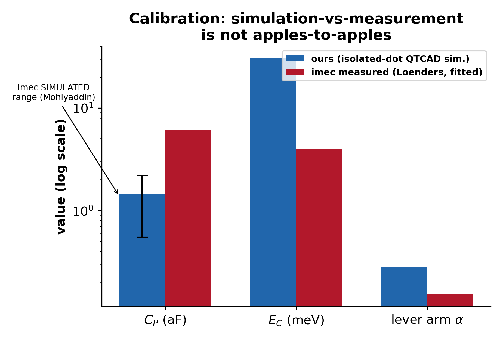

# QTCAD simulation of a SiMOS quantum-dot device

A finite-element Schrödinger-Poisson simulation of an industrial gate-defined
silicon quantum dot, built from a published device geometry and validated against
both a vendor-documented reference and independent literature — including a real
bug found mid-project, fixed, and verified against a 25× change in the extracted
lever arm.

This is quantum-device TCAD: simulating the electrostatics and quantum confinement
of a spin-qubit platform, as distinct from classical semiconductor device TCAD.

## What's here


The device is a 3×3 interior cell of imec's published 7×7 SiMOS quantum-dot array
(overlapping polysilicon gate stack, real gate widths from the published geometry),
solved self-consistently for the confining potential and the bound quantum states
of the central dot.


## Status

**Phase 0: model correctness.** The simulation pipeline is built and validated —
the quantities in the tables below are measured, not assumed. The next phase
(extending this to novel multi-tier device architectures) is in progress and not
yet part of this repository.

## What's validated

| check | result |
|---|---|
| Reproduction of a vendor-documented reference device | <0.1% error on every reported quantity (addition energies, capacitances, lever arms) |
| Valley-splitting solver vs. published benchmark (Gamble, APL 2016) | exact linear reproduction, 0.1025 meV per MV/m |
| Single-particle lever arm vs. a comparable industrial device | 0.283 eV/V vs. 0.26 eV/V published (+8.9%) |
| Two independently-computed lever arms (single-particle vs. chemical-potential) | agree to 2% |
| Simulated capacitance & turn-on voltage vs. imec's own 3D simulation of the same device family | inside the published range |

Full details, including the honest discussion of where this model does *not*
match published numbers and why: [docs/validation.md](docs/validation.md).


## A bug, found and fixed

Partway through the project, the single-particle lever arm came out **30× too
small**. The cause was a single missing API call (`set_dot_region()`) that let a
classical electron gas sit inside the quantum dot and screen the gate — the solve
converged cleanly, with nothing in the log to flag it. Found by re-reading vendor
examples line by line, not by running more simulations; fixed; and verified by an
independent second calculation agreeing with the first to 2% post-fix (they had
differed by 25× before it).

Full writeup: [docs/debugging_notes.md](docs/debugging_notes.md).

## Calibration is not just "compare to the measured number"



A simulated plunger capacitance of 1.45 aF looks like a 4× miss against imec's
measured 6.1 aF — until you notice that the measured value is a **parallel-plate
fit** to Coulomb-diamond data, while this is a **3D wavefunction-based**
calculation, and imec's own 3D simulation of the same device family lands in the
same range this one does. Comparing simulation to simulation instead of simulation
to a fitted extraction changes the conclusion entirely. Details in
[docs/validation.md](docs/validation.md).

## Repository layout

```
src/          simulation scripts (geometry builder, device/solver, campaigns,
              post-hoc field/footprint extraction, figure generation)
results/      extracted numeric results (text), the raw material for the figures
figures/      the 9 figures referenced above and in the docs
docs/         device specification, methodology, validation, debugging notes,
              references
```

## Reproducing

Figures 1–6 are pure post-processing and need no license:

```bash
conda env create -f environment.yml   # or just: pip install numpy matplotlib
python src/make_figures_from_results.py
```

Figures 7–9 and all `src/*.py` simulation scripts require a
[QTCAD](https://docs.nanoacademic.com/qtcad/) license from Nanoacademic
Technologies — see [THIRD_PARTY_NOTICES.md](THIRD_PARTY_NOTICES.md). Generated
meshes and saved potential fields are not shipped (too large, and regenerable);
each script's docstring documents exactly how to reproduce its inputs.

## References

Cited literature and software: [docs/references.md](docs/references.md).

## License

Code and documentation in this repository are MIT licensed — see
[LICENSE](LICENSE). This does not cover QTCAD or any cited third-party literature
(see [THIRD_PARTY_NOTICES.md](THIRD_PARTY_NOTICES.md)).
