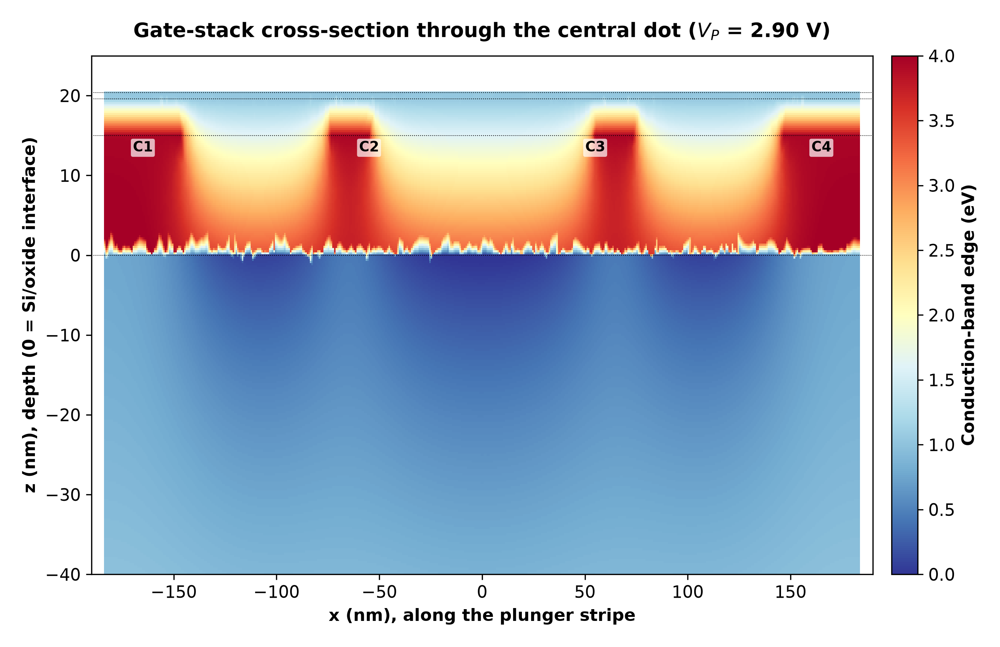
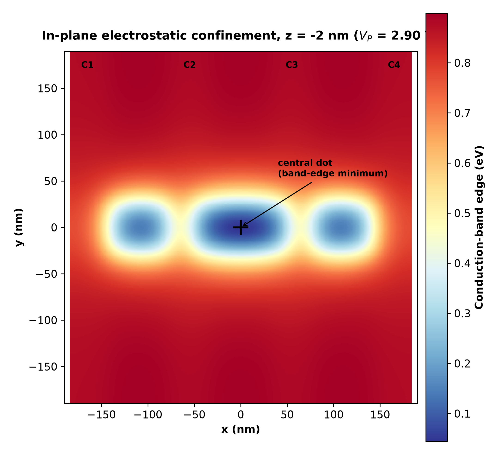
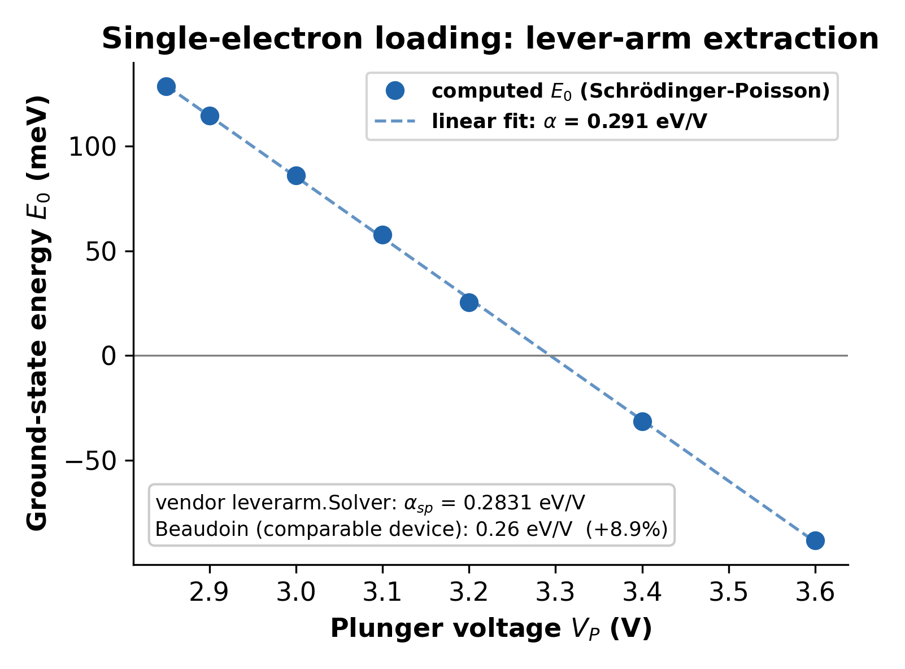

# imec Quantum-Dot QTCAD Simulation

A finite-element Schrödinger-Poisson simulation of imec's published gate-defined
silicon quantum-dot device, built from scratch and calibrated against imec's own
published measurements and simulations. This README reports every quantity
measured so far, including a real bug found mid-project, fixed, and verified
against an independent cross-check.

This is quantum-device TCAD: simulating the electrostatics and quantum confinement
of a spin-qubit platform, as distinct from classical semiconductor device TCAD.

## Device



A 3×3 interior cell of imec's published 7×7 SiMOS quantum-dot array (overlapping
polysilicon gate stack, real gate widths from the published geometry), solved
self-consistently for the confining potential and the bound quantum states of the
central dot. Full device specification, sourced line by line:
[docs/device_spec.md](docs/device_spec.md).



## Status

**Phase 0: model correctness**, complete. The tables below are every quantity
measured so far. Phase 1 (extending this to novel device architectures) is in
progress; results will be added here as they're produced.

## Results

### 1. Method validation (independent of imec)

Checked against tool-vendor references and independent literature before trusting
the model on imec's device at all.

| check | result |
|---|---|
| Reproduction of a vendor-documented reference device | <0.1% error on every reported quantity (addition energies, capacitances, lever arms) |
| Valley-splitting solver vs. published benchmark (Gamble, *APL* 109, 253101, 2016) | exact linear reproduction, 0.1025 meV per MV/m |
| Single-particle lever arm vs. a comparable industrial FD-SOI device (Beaudoin et al.) | 0.283 eV/V vs. 0.26 eV/V published, **+8.9%** |
| Two independently-computed lever arms (single-particle vs. chemical-potential), internal cross-check | **agree to 2%** (differed by 25× before the bug fix below) |

### 2. Calibrated against imec's own simulation (Mohiyaddin et al., IEDM 2019)

Simulation-to-simulation comparison, same device family, same tool class
(Sentaurus `sband`/QTCAD are both Schrödinger-Poisson solvers) — the
methodologically matched comparator for a first-principles 3D calculation.

| quantity | this simulation | imec (simulated) | agreement |
|---|---|---|---|
| Gate-to-dot capacitance (t_ox = 20 nm) | 1.45 aF | 0.55 – 2.2 aF | inside range |
| Voltage for first electron (t_ox = 20 nm) | 3.29 V | 1.45 – 4.05 V | inside range |
| Orbital level spacing, few-electron regime | 10.7 – 11.3 meV | ~10 meV | consistent |
| Vertical confining field in the dot | 309 – 329 kV/cm | ~200 kV/cm | same order (~1.6×) |
| Gate work function (published value, adopted not fitted) | 4.70 eV | 4.70 eV | exact |

### 3. Compared against imec's measured device (Loenders et al.)

Direct comparison to the fabricated, measured array. Reported as-is, with the
reason each ratio is what it is — a real research repository shows the numbers
that don't match a naive read, not just the ones that do.

| quantity | this simulation | imec (measured, fitted) | ratio | why |
|---|---|---|---|---|
| Plunger capacitance C_P | 1.45 aF | 6.1 ± 0.2 aF | 4.2× low | imec's value is a **parallel-plate fit** to Coulomb-diamond data, not a first-principles capacitance. Their own 3D simulation (table above) lands in the same range this does — see [docs/validation.md](docs/validation.md) §4. |
| Total dot capacitance C_Σ | 5.22 aF | 40 ± 10 aF | 7.7× low | This device has no source/drain reservoirs modeled — C_Σ on the real array is dominated by reservoir coupling, not the plunger, per imec's own paper. Declared scope limit, not a fitting error. |
| Charging energy E_C | 30.7 meV | 4.0 meV | 7.7× high | Same reservoir-coupling effect as C_Σ (E_C = e/C_Σ); consistent in direction and magnitude with the isolated-dot assumption. |
| Lever arm α = C_P/C_Σ | 0.278 | 0.152 | 1.8× high | The one quantity here with **no simulation comparator to check against** — Mohiyaddin don't publish a simulated α. Genuinely open; not yet explained. |

Full detail on all of the above, including how each conclusion was reached:
[docs/validation.md](docs/validation.md).



## A bug, found and fixed

Partway through the project, the single-particle lever arm came out **30× too
small**. The cause was a single missing API call (`set_dot_region()`) that let a
classical electron gas sit inside the quantum dot and screen the gate — the solve
converged cleanly, with nothing in the log to flag it. Found by re-reading vendor
examples line by line, not by running more simulations; fixed; and verified by an
independent second calculation agreeing with the first to 2% post-fix.

Full writeup: [docs/debugging_notes.md](docs/debugging_notes.md).

## Future work

Extending this validated model to novel device architectures beyond the imec
reference array. Not yet started; results will be reported here once produced.

## Repository layout

```
src/          simulation scripts (geometry builder, device/solver, campaigns,
              post-hoc field/footprint extraction, figure generation)
results/      extracted numeric results (text), the raw material for the tables above
figures/      the 9 figures referenced above and in the docs
docs/         device specification, methodology, validation, debugging notes,
              references
```

## Reproducing

Figures 1–6 are pure post-processing and need no license:

```bash
conda env create -f environment.yml   # or just: pip install numpy matplotlib
python src/make_figures_from_results.py
```

Figures 7–9 and all `src/*.py` simulation scripts require a
[QTCAD](https://docs.nanoacademic.com/qtcad/) license from Nanoacademic
Technologies — see [THIRD_PARTY_NOTICES.md](THIRD_PARTY_NOTICES.md). Generated
meshes and saved potential fields are not shipped (too large, and regenerable);
each script's docstring documents exactly how to reproduce its inputs.

## References

Cited literature and software: [docs/references.md](docs/references.md).

## License

Code and documentation in this repository are MIT licensed — see
[LICENSE](LICENSE). This does not cover QTCAD or any cited third-party literature
(see [THIRD_PARTY_NOTICES.md](THIRD_PARTY_NOTICES.md)).
